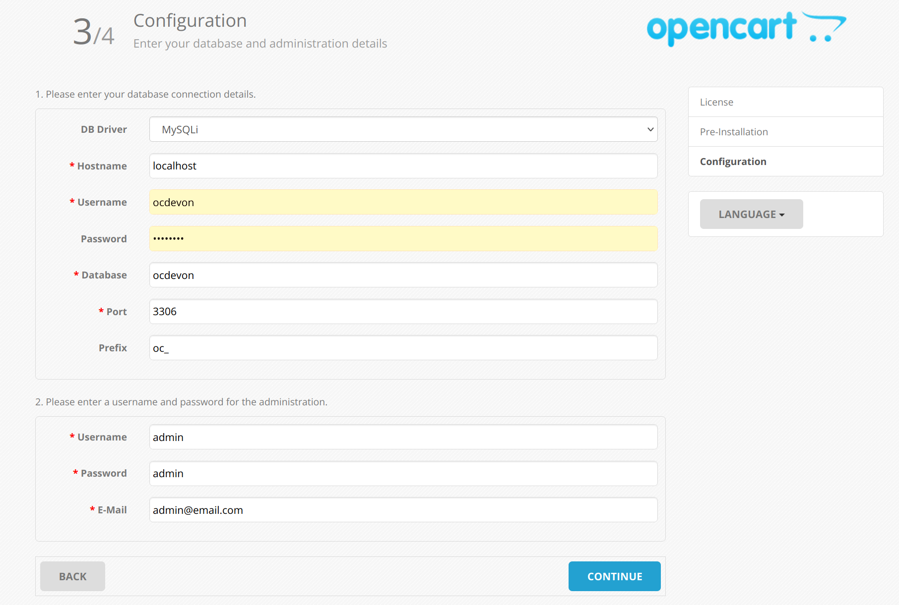

# BSA Troop Devon 50 Sales

## Prepare your local play ground

TODO: Document `podman` installation procedure and the use.

1. If not done already, install "Docker Desktop" on your local computer. Follow instructions at https://www.docker.com/get-started

2. Build Docker image next for OC SandBox, like so:

```bash
make build
```

3. Setup OC SandBox:

```bash
# Start Docker container
make run
```

.. once in docker terminal, run installation script as follows:

```bash
# Needed only once
root@{dockerhost}:/ sh oc-install.sh
```

.. next open http://localhost/index.php in your browser and complete setup flow. 
In installation wizard step 3, enter local development credentials as follows.




4. Your OC SandBox environment is ready.
